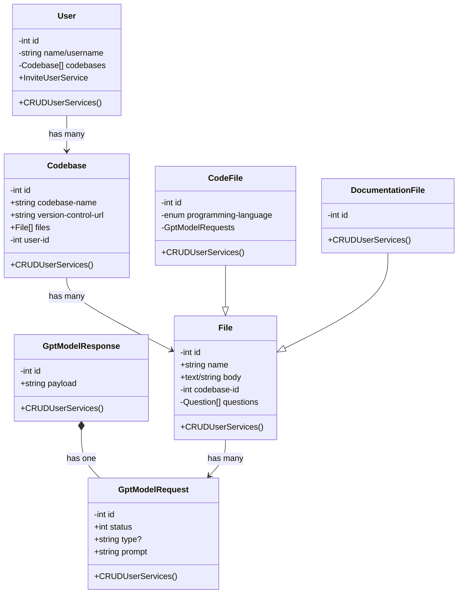

# README

## Project Description

## Project Planning and UML
### This is the initial UML design and I am sure this is bound to change as I get moving

```mermaid
classDiagram
    direction TD
    class GptModelRequest{
        -int id
        +int status
        +string type?
        +string prompt
        +CRUDUserServices()
    }

    class GptModelResponse{
        -int id
        +string payload
        +CRUDUserServices()
    }

    class User{
        -int id
        -string name/username
        -Codebase[] codebases
        +CRUDUserServices()
        +InviteUserService
    }

    class Codebase{
        -int id
        +string codebase-name
        +string version-control-url
        +File[] files
        -int user-id
        +CRUDUserServices()
    }

    class File{
        -int id
        +string name
        +text/string body
        -int codebase-id
        -Question[] questions
        +CRUDUserServices()
    }

    class CodeFile{
        -int id
        -enum programming-language
        -GptModelRequests
        +CRUDUserServices()
    }

    class DocumentationFile{
        -int id
        +CRUDUserServices()
    }

    GptModelResponse *-- GptModelRequest : has one
    User --> Codebase : has many
    Codebase --> File : has many
    CodeFile --|> File
    DocumentationFile --|> File
    File --> GptModelRequest : has many
```
