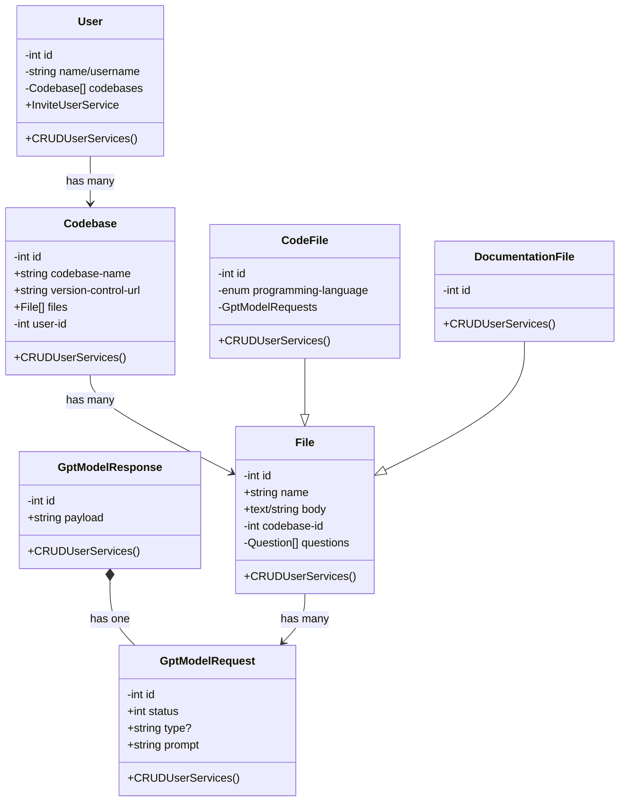

# README

# Project Description & Introduction

## Introduction
### Welcome to Ctrl-Shift-Find, my self-guided Senior Project for my BS in Computer Science at UCM. This project was a chance for me to take a deep dive into any technologies I wanted, so I took the opportunity to familiarize myself with Ruby on Rails and utilize OpenAI's ChatGPT API to make completions.

## What is Ctrl-Shift-Find?
### Ctrl-Shift-Find was meant to be a fun practice project designed to help me understand programming errors and questions. Before the wide integration/implementation of GitHub Copilot and other AI tools, I had to use websites like StackOverflow or chat with my fellow students/coworkers to get answers about why strange errors were happening in my code. With the rise of the popularity of ChatGPT and its API, I saw an opportunity to leverage the LLM to answer questions I had about programming issues. The project was designed with a repository-like structure where a user would eventually be able to create/add a codebase and then open files where you could ask the models questions about the given context. I ended up only having time that final semester to get a bare-bones version of this working, but I was extremely pleased with how it all turned out.

## Why Ruby on Rails?
### At the start of my senior year, I accepted a part-time internship position at One Body where the main tech stack revolves around Ruby on Rails. Having no experience with it before the position, I thought this would be a good excuse to ramp up my skills with the language even faster.

## Why ChatGPT?
### At the time, ChatGPT was becoming one of the hottest tools in the world, so with my curiosity piqued, I wanted to learn more about it.

## Project Planning and UML
### Utilizing Mermaid JS for documentation, I developed this UML diagram for the basic structure of this project. I used JIRA with my professor to set weekly sprints and gave myself a realistic deadline to meet the class's expectations.

